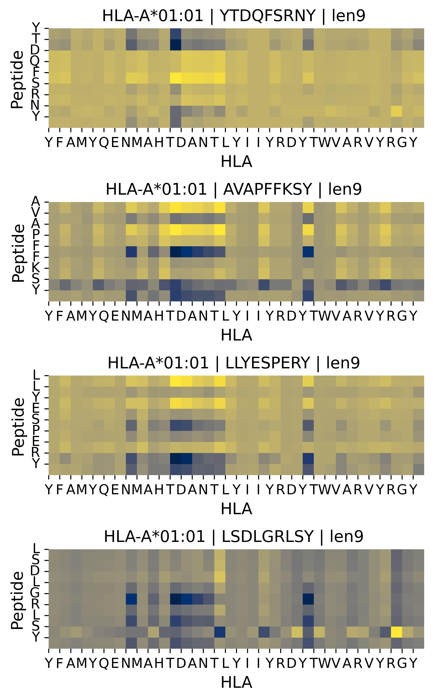
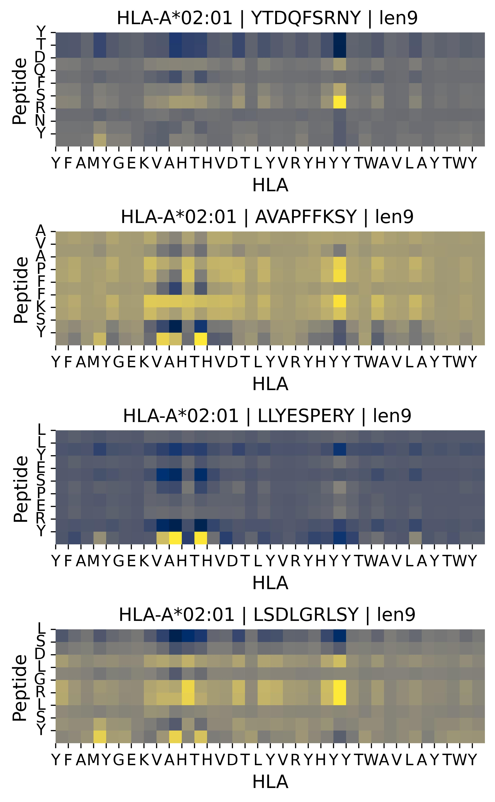
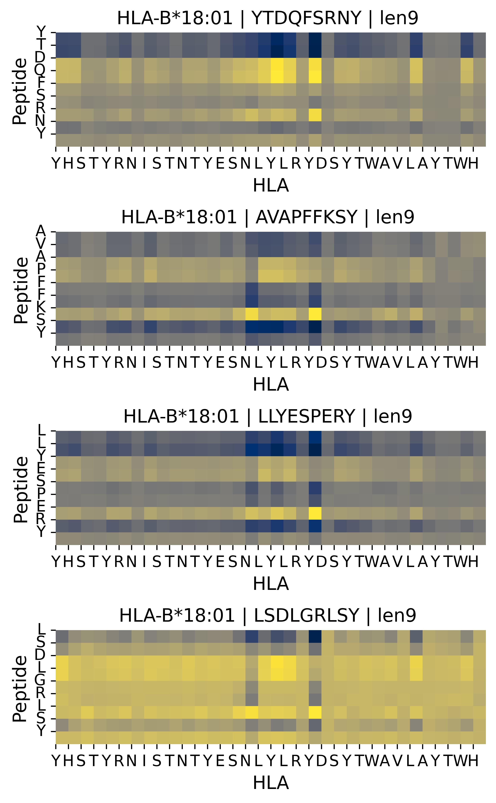

# SeqDA-HLA: Language model and dual attention-based network to predict peptide-HLA class I binding

This is the official repository of SeqDA-HLA model.

SeqDA-HLA is a pan-specific model that predicts peptide-HLA class I binding using a language model and an attention-based network. This method extracts useful biological patterns from the peptide and HLA sequences.

## 1. Model Architecture
<div style="padding: 20px 20px 10px 20px; margin-bottom: 20px; background-color: white; display: inline-block;">
  
</div>
<br/>
SeqDA-HLA takes two primary inputs: HLA and peptide sequences encoded using pre-trained ELMo representations. These inputs are first processed by a self-aligned cross-attention module, followed by feedforward layers and a self-attention module. Finally, a classifier is applied to predict the binding score for the peptide-HLA complex.


## 2. Results
### **Evaluation Metrics**
**A**: pre-trained ELMo representations, **B**: Self-aligned cross-attention module, **C**: Self-attention module.

|   A   |   B   |   C   | Accuracy  |   AUC    |   F1     |   MCC    |
|:-----:|:-----:|:-----:|:---------:|:--------:|:--------:|:--------:|
|   ✓   |   ✓   |   ✓   | **0.8983** | **0.9693** | **0.8913** | **0.8038** |
|   ✓   |   ✓   |       |   0.8947  |  0.9668  |  0.8865  |  0.7979  |
|   ✓   |       |       |   0.8936  |  0.9650   |  0.8856  |  0.7954  |
|       |   ✓   |   ✓   |   0.7764  |  0.8514  |  0.7745  |  0.5528  |

### **Attention Heatmap**
The SeqDA-HLA model leverages attention mechanisms to visualize the binding patterns between HLA and peptides. Each column shows the binding pattern of various peptides with the same HLA type.
<p align="center" style="display: flex; justify-content: center; gap: 0; margin: 0;">
  
  
  
</p>

## 3. Datasets
We integrated datasets retrieved from several sources, including [NetMHCpan-4.0](https://services.healthtech.dtu.dk/suppl/immunology/NetMHCpan-4.0/), [NetMHCpan-4.1](https://services.healthtech.dtu.dk/suppl/immunology/NAR_NetMHCpan_NetMHCIIpan/), [SMMPMBEC](http://tools.iedb.org/mhci/download/), and [TransPHLA](https://github.com/a96123155/TransPHLA-AOMP/tree/master/Dataset). Two types of test data was used to evaluate the perfomance of peptide-HLA binding prediction of our proposed model, SeqDA-HLA.

## 4. Getting Started
### 1) Installation
Download the code:
```
git clone https://github.com/Ewha-AI/SeqDA-HLA.git
cd SeqDA-HLA
```

A suitable conda environment named `seqdahla` can be created and activated with:
```
conda env create -f environment.yaml
conda activate seqdahla
```

### 2) Downloading the pre-trained SeqVec weights

• Peptide Embeddings

 1. Download the weights and options files from the [SeqVec](https://github.com/rostlab/SeqVec):
    - `weights.hdf5`: Pre-trained weights for the SeqVec model.
    - `options.json`: Options file for the SeqVec model.

2. Place these files in the `model` directory.
```bash
├── model
│   ├── weights.hdf5
│   └── options.json
```
<br/>
• HLA Embeddings

We provide the HLA embeddings file `total_HLA_embedding.hdf5`, generated using pre-trained SeqVec in the `utils` directory.
The file includes a dictionary of HLA type and the corresponding representation.

## 5. Model Inference
Once your test data is ready, you can use the `main_inference.py` script to perform model inference. Execute the following command:

```
python main_inference.py
```
